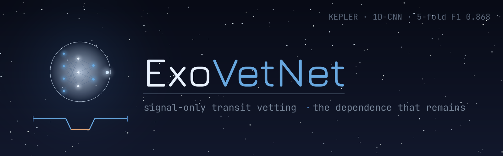

<!-- Banner -->

    

Signal-only dual-branch 1D-CNN for vetting Kepler exoplanet transits.
This project serves as a continuation of EclipseSieve, which determined the dependence that Exoplanet Vetters have on the catalog.

    
    
    
    

> *TL;DR* - ExoVetNet is a signal-only dual-branched 1D-CNN that vets Kepler transits from their light curves. ExoVetNet makes decisions independently of catalog-derived features. The model serves as a continuation of [EclipseSieve](https://github.com/lukashaardt-ux/EclipseSieve), which determined the immense catalog dependency of exoplanet vetting pipelines. ExoVetNet asks whether exoplanet vetting is still viable without catalog features. The model reached a 5-fold cross validation F1 score of 0.868 ± 0.01, which approaches EclipseSieve's catalog-driven F1 of 0.890. **Overall, ExoVetNet determined that signal-only vetting still faces catalog dependency.** This dependency is relocated from features to folding in preprocessing.

## Table of Contents

- [Background](#background)
- [Approach](#approach)
- [Data & preprocessing](#data-preprocessing)
- [Model & training](#model-training)
- [Results](#results)
- [Null results](#null-results)
- [The catalog-dependency audit](#the-catalog-dependency-audit)
- [Failure analysis](#failure-analysis)
- [Interpretability](#interpretability)
- [Candidate application](#candidate-application)
- [Limitations](#limitations)
- [Future work](#future-work)
- [Reproducing](#reproducing)
- [References](#references)

## Background
- **Goal:** Find exoplanets based on the periodic dip in their brightness when a possible object passes in front of a star. This change in magnitude is visualized with a light curve. However, not all dips are planets, possible false positives include eclipsing binaries and other configurations that can mimic possible exoplanets, which means that signals need to be *vetted* before they can appropriately be classified. 

- **EclipseSieve:** [EclipseSieve](https://github.com/lukashaardt-ux/EclipseSieve) is a machine learning pipeline that *vetted* signals based on the features of the light curve, as well as the physical features of the system. EclipseSieve reached an F1 of 0.890, but further examination revealed that the model was heavily reliant on features that originated from NASA's catalog, which in turn leak the label of the signal.

- **Research Question:** If catalog features are leaking information to the model, can a model accurately vet from the raw light-curve signal alone and produce an honest result? That is the essence behind ExoVetNet.
## Approach
- **Input:** The pipeline receives two views of a folded light curve signal. Each exoplanet candidate is phase-folded on its ephemeris and then split into two views. First, a global view, which is made of the entire folded light curve. Second, a local view, which is zoomed in on the transit. 

- **A dual-branch 1D-CNN.** Each branch of the CNN receives a type of view respectively. The data from both views is eventually merged and passed to a dense head that outputs a verdict a probability from 0 (false positive) to 1 (planet). The structure is not a novel one, and is based on the architecture from [Shallue & Vanderburg (2018)](https://iopscience.iop.org/article/10.3847/1538-3881/aa9e09).

- **Why this structure.** This structure allows the model to view two entirely different stories of the light curve. The global view reveals features at the "macro" level, such as eclipsing binaries and differences in the out-of-transit (OOT) data. The local view examines transit morphology and shows discrepancies at the "micro" level around and at the transit. However, ExoVetNet's contribution should not be seen as the architecture but rather the audit.

## Data & preprocessing

## Model & training

## Results

## Null results

## The catalog-dependency audit

## Failure analysis

## Interpretability

## Candidate application

## Limitations

## Future work

## Reproducing

## References